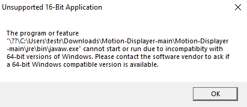
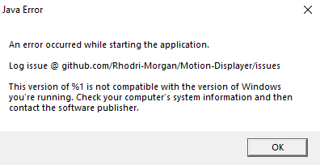

You may be confronted with these error messages when trying to run the executable:






This is likely because the `jre` git lfs hosted files have not been downloaded properly. 

In order to properly run the executable please download the lfs objects and not just the pointers.

To fix this clone the repository using these commands:

```shell
git lfs install --skip-repo
git lfs clone https://github.com/Rhodri-Morgan/Motion-Displayer
```

**Do not clone through GitHub UI 'Download Zip' as this does not respect git lfs objects.**